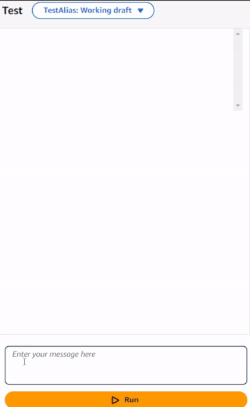
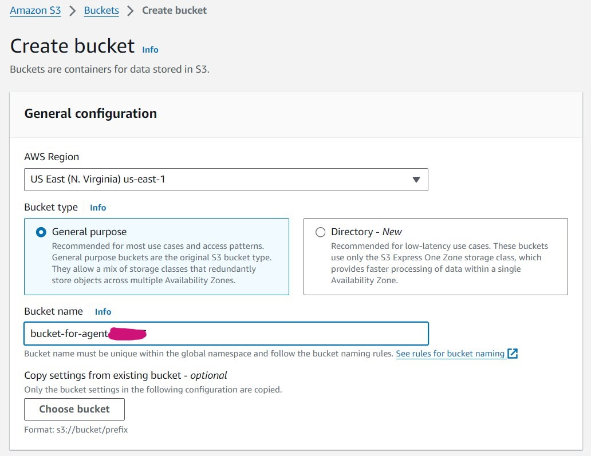

# AI Telegram Chat assistant with Amazon Bedrock agent.

Welcome to building GenAI Telegram Chat assistant using Amazon Bedrock Agents. 


## What Chat Assistant Can Do



### 1 - Get latest chat updates:

:iphone: You can ask agent to pull message updates from a specific Telegram chat.

The chat name doesn't have to be an exact match, because orchestration Lambda function will handle name-to-id conversion.


### 2 - Translate messages:

:arrows_clockwise: If chat is in a language other than English, you can ask to translate it to English


### 3 - Summarize messages:

:bookmark_tabs: You can ask for a summary of messages from a specific chat.

If your chat is in a language other than English, the language will be detected and the chat will be translated to English before summarization.


### 4 - Query chats based on a custom prompt:

:mag: You can query a specific chat by asking any questions.

If your chat is in a language other than English, the language will be detected and the chat will be translated to English before querying.


## What is Bedrock Agent?

Agents for Amazon Bedrock helps you accelerate generative artificial intelligence (AI) application development by orchestrating multistep tasks.
They can make different API calls. 
Agents extend FMs to understand user requests, break down complex tasks into multiple steps, carry on a conversation to collect additional information, and take actions to fulfill the request.

- AWS News Blog: [Enable Foundation Models to Complete Tasks With Agents for Amazon Bedrock](https://aws.amazon.com/blogs/aws/preview-enable-foundation-models-to-complete-tasks-with-agents-for-amazon-bedrock/)
- AWS News Blog: [Agents for Amazon Bedrock is now available with improved control of orchestration and visibility into reasoning](https://aws.amazon.com/blogs/aws/agents-for-amazon-bedrock-is-now-available-with-improved-control-of-orchestration-and-visibility-into-reasoning/)
- [How Agents for Amazon Bedrock works](https://docs.aws.amazon.com/bedrock/latest/userguide/agents-how.html)

## Let's build!

### :zero: Step 0: Create Telegram bot and obtain token

Go to Telegram bot father, [create bot](https://core.telegram.org/bots/features#creating-a-new-bot) and save the token. 
Be careful with the token and save it in a safe place. We will use it when getting message updates.

Add your bot to chat(s) from where you want to receive updates. 

### :one: Step 1: Create DynamoDB table

We will create a DynamoDB table with Telegram chats that our bot can reach. The main purpose of the table is to align chat names with their ids. The Bedrock agent can refer the chat by name (even without exact match), and Lambda function can find in DynamoDB a corresponding chat id and filter messages updates by this chat id.

As per May 2024, [Bedrock agents are available in the following regions:](https://docs.aws.amazon.com/bedrock/latest/userguide/agents-supported.html)
- US East (N. Virginia)
- US West (Oregon)
- Asia Pacific (Singapore)
- Asia Pacific (Sydney)
- Asia Pacific (Tokyo)
- Europe (Frankfurt)

That's why it will be a good idea to create DynamoDB table and Lambda Function in the same region where we are planning to create an agent (to decrease cross-region latency and avoid potential cross-region data transfer costs).

1. Navigate to the [DynamoDB console](https://us-east-1.console.aws.amazon.com/dynamodbv2/home?region=us-east-1#service) and click on `Create table`.
2. Enter `bedrock_agent_chats` as `Table name` and `bot_id` as `Partition key`. Click on the `Create table` button.


3. Once the table is created, let's populate it with values. Click on the created table, then click on the `Actions` button and select `Create item` from the drop-down list.
4. Paste `100200300` as `bot_id` (or another Id value, but make sure to use the same bot Id in Lambda function environment variables later on)
5. Click on the `Add new attribute` button and select `List`. Paste `chats` as Attribute name
6. Click on the first `Insert a field` button and choose `Map`
7. Click on the lowest `Insert a field` button and choose `String`. Paste `chat_id` as Attribute name and your Telegram chat id (typically starting from '-') as value. [How to get telegram chat id](https://medium.com/@2mau/how-to-get-a-chat-id-in-telegram-1861a33ca1de).
8. Click on the lowest `Insert a field` button and choose `String`. Paste `chat_name` as Attribute name and your Telegram chat name as value.
9. Repeat steps 6-8 to add more chats, once ready, click on the `Create item` button.


### :two: Step 2: Create Lambda Function

Lambda Function will manage all the logic required for the agent actions.
Code contains set of APIs that Bedrock agent will call. The function will then format the response and send it back to the agent.


#### Create Lambda:

1. Navigate to the [Lambda Console](https://us-east-1.console.aws.amazon.com/lambda/home?region=us-east-1#/functions) and click on `Create function` button. 
Make sure that `US East (N. Virginia)` or `US West (Oregon)` is selected as region.
2. Paste `ChatSummarizer` as a function name and choose `Python 3.12` as a runtime
3. Click on `Create function` button in the bottom of the page


#### Update Lambda permissions:
1. Once the function is created, click on the Configuration Tab in the same page and Choose `Permissions` from the left side panel
2. Click on `Add permissions` button in Resource-based policy statement section to provide the permission to invoke lambda functions from Bedrock
3. Provide Statement Id as `agent`, Principal as `bedrock.amazonaws.com` and Action as `lambda:InvokeFunction`. Click Save after adding all the above three information.


4. Add the following Policy Statement to your Execution role, so Lambda can call Bedrock. (You can find details [here](https://docs.aws.amazon.com/IAM/latest/UserGuide/access_policies_manage-attach-detach.html#add-policies-console))
```{
    "Version": "2012-10-17",
    "Statement": [
        {
            "Sid": "VisualEditor0",
            "Effect": "Allow",
            "Action": "bedrock:InvokeModel",
            "Resource": "*"
        }
    ]
}
```
5. Add `AmazonDynamoDBReadOnlyAccess` and `TranslateReadOnly` policies to your Execution role, so Lambda can call DynamoDB, Comprehend and Translate.


#### Add environment variables:

1. Once permissions are updated, go back to the `ChatSummarizer` lambda, click on the `Configuration` Tab in the same page and Choose `Environment variables` from the left side panel 
2. Click `Edit` button to add environment variables
3. By clicking `Add environment variable` button add the following key value pairs:
- `BOT_ID`: `100200300` (you can change it to any unique value, make sure you use the same Id for your bot_id partition key in DynamoDB table)
- `BOT_TOKEN`: insert your Telegram bot token obtained in Step 0
- `DEFAULT_CHAT_ID`: value should start from `-`, paste the Telegram chat id you want to use as default 
- `DYNAMODB_TABLE_NAME`: `bedrock_agent_chats`


#### Adjust the timeout:

1. Choose `General configuration` from the left side panel 
2. Click on the `Edit` button
3. Modify `Timeout` by increasing it to 15 seconds to make sure your Lambda won't fail while waiting for Bedrock models to respond.
4. Click on the `Save` button


#### Add code:

1. To use this project code, clone the repo:
```
https://github.com/dashapetr/smart-assistant-agent.git
cd smart-assistant-agent
```
2. Create a new directory named package into which you will install your dependencies.
```
mkdir package
```
3. Install your dependencies in the package directory. 
```
pip install --target ./package requests
pip install --target ./package fuzzywuzzy
```
4. Create a .zip file with the installed libraries at the root.
```
cd package
zip -r ../my_deployment_package.zip .
```
This generates a `my_deployment_package.zip` file in your project directory.

5. Add code files to the root of the .zip file
```
cd ..
zip my_deployment_package.zip lambda_function.py
zip my_deployment_package.zip tools.py
```
6. Now you can go back to the Lambda function, click on the `Code` tab in the same page 
7. Click on the `Upload from` button and select `.zip file` in the dropdown list
8. Select `my_deployment_package.zip` and upload it, click on the `Save` button
9. Your code should appear inside the `Code source` window


Zip deployment package creation steps are described with additional details in the [documentation](https://docs.aws.amazon.com/lambda/latest/dg/python-package.html#python-package-create-dependencies). 

#### Test your Lambda:

Since our Lambda contains a set of APIs, you may want to create several test events to test each API.

1. Click on the `Test` tab near the top of the page.
2. Fill in `Event name`: `summarize` 
3. Paste the code from `test-payload-lambda/summarize.json` in `Even JSON` window. 
This will be a test event for the `summarize` API that matches how the Agent will send a request.
4. Click on `Save` and then `Test` to execute the Lambda function. You should see the results of the function invocation, which will be a summarization response from the Titan Model.


5. Click on `Create new event` button and repeat steps 2-4 to add more test events (you can find JSON payloads in the `test-payload-lambda` folder) 

### :three: Step 3: Add OpenAPI spec file to S3

The [OpenAPI Specification (OAS)](https://swagger.io/specification/) defines a standard, language-agnostic interface to HTTP APIs which allows both humans and computers to discover and understand the capabilities of the service without access to source code.

Bedrock agent will be able to understand what tool to use based on the user request, the agent then will call the correct endpoint due to the OpenAPI spec.

1. Go to [S3 console](https://s3.console.aws.amazon.com/s3/get-started?region=us-east-1&bucketType=general) and click on the `Create bucket` button
2. Make sure that `US East (N. Virginia)` or `US West (Oregon)` is selected as region (select the same where your DynamoDB and Lambda reside). 
3. Give your bucket a unique name, for example `bucket-for-agent-NUMBERS`. Click `Create bucket`.



4. Select your created bucket, click on the `Upload` button.
5. You can drag and drop `openapi-schema.json` file and then click on the `Upload` button

### :four: Step 4: Configure Bedrock agent

Now as all the preparation is done, we can proceed with Bedrock agent creation.
**Prerequisites**: we will use `Anthropic Claude 3 Haiku v1` as model, make sure that you [have access to it in your account](https://docs.aws.amazon.com/bedrock/latest/userguide/model-access.html).
**Note**: the new [simplified experience to create and manage Agents](https://aws.amazon.com/blogs/aws/agents-for-amazon-bedrock-introducing-a-simplified-creation-and-configuration-experience/) in the US East (N. Virginia) and US West (Oregon) AWS Regions has been introduced recently. The steps below reflect this simplified version.

1. Go to [Bedrock console](https://us-east-1.console.aws.amazon.com/bedrock/home?region=us-east-1#/overview), select `Agents` in the left navigation panel, then click on the `Create Agent` button
2. Provide `smart-assistant-agent` as Agent name, provide a description (optional). Click on the `Create` button.
3. You are now presented with the Agent builder, the place where you can access and edit the overall configuration of an agent. 
We will select `Anthropic Claude 3 Haiku v1` as model ([Pricing](https://aws.amazon.com/bedrock/pricing/)); Paste the following text as Instructions for the Agent:
```markdown
You are a smart assistant designed to pull out the messages from a specific Telegram chat. 
You will translate pulled messages into English if they are not in English. 
If you are asked to summarize messages, summarize messages. 
If you are asked a specific question, query the chat messages based on the provided prompt.
```
Leave all the rest as default. Then, choose `Save` to update the configuration of the agent.

4. Next, we will add Action group: choose `Add` in the Action groups section. Use `chat-reading-summarizing-action-group` as Action group name.
In the Action group type section, select `Define with API schemas`. In the Action group invocation section, select `Select an existing Lambda function` and select `ChatSummarizer` as Lambda function. 
In the Action group schema section, select `Select an existing API schema`, browse S3 and select the `openapi-schema.json` file. Click on `Save and exit`.


### :five: Step 5: Test it out!

Once the agent is created, feel free to test it! Look for the `Test Agent` section, choose `Prepare` to prepare the agent. Ask questions and observe results.

Additionally, you can evaluate the chained process of agents reasoning by looking at **Trace** for your request.
It contains reasoning steps for **Pre-Processing trace**, **Orchestration and Knowledge Base**, and **Post-Processing trace**


:warning: Note: Keep in mind that Telegram API pulls updates for the recent 24 hours. 
If you want to be able to browse chats history, please refer to the [official documentation](https://core.telegram.org/bots/).

## Conclusion and more ideas: 

Bedrock Agents would be a great choice for orchestration and automation for chains-like tasks. 
They are very flexible and easily extensible, so they can act as smart assistant in various scenarios (for example, customer support).

If you enjoyed agents, you might also like:
- [Amazon Bedrock Agents Quickstart workshop](https://github.com/build-on-aws/amazon-bedrock-agents-quickstart/tree/main) by Banjo Obayomi
- Building an Amazon Bedrock JIRA Agent with Source Code Knowledge Base - [Part 1](https://community.aws/content/2aB8MoS2mXcfRKeUbVRVVEG4AWJ/trying-out-amazon-bedrock-agents-and-knowledge-bases) and [Part 2](https://community.aws/content/2b3H2e2qcvwgustxLWb2E4VKygh/building-an-amazon-bedrock-jira-agent-with-source-code-knowledge-base) by Martyn Kilbryde
- [Shopify Customer Care powered by GenAI](https://community.aws/content/2dJUQiedCwDfOzNrbW8z9awWgxy/introducing-amazon-bedrock-agents-to-take-your-shopify-management-to-the-next-level-with-generative-ai) by Ricardo Ceci
- [Build a retail agent](https://github.com/aws-samples/agentsforbedrock-retailagent) by Manju Prasad and Amit Arora
- [Webscrape and internet search agent](https://github.com/build-on-aws/bedrock-agents-webscraper) by Justin Ossai
- [Automate the insurance claim lifecycle using Agents and Knowledge Bases for Amazon Bedrock](https://aws.amazon.com/blogs/machine-learning/automate-the-insurance-claim-lifecycle-using-agents-and-knowledge-bases-for-amazon-bedrock/) by Kyle Blocksom
